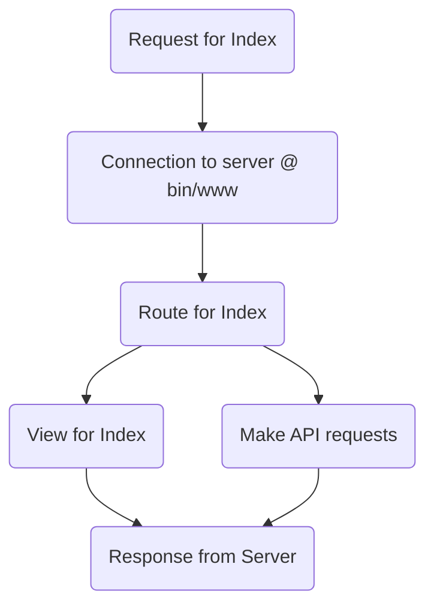

# Class Notes
## About
Class notes is a collaborative note-taking platform made for students, focusing on their experience, rather than the educators. It is designed to make revision easier, faster, more interactive and ultimately, more effective.

## Design
The code is designed around a basic View/Model/Controller architecture, using mongodb as its database of choice. 
The following flow diagram expresses the process


## Browsing

## Installation
To run an instance of class notes, pleace clone the repository and setup a .env file with the following variables
 - A session secret, any long string

Then, execute the following commands from the terminal
```
npm install
npm start
```
This should automatically compile the typescript, and startup the server. Once the typescript is installed you can use `node bin/www` or `npm run compiled` to start the server.